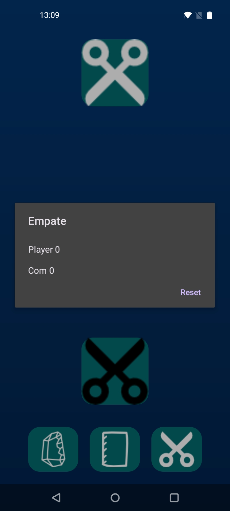
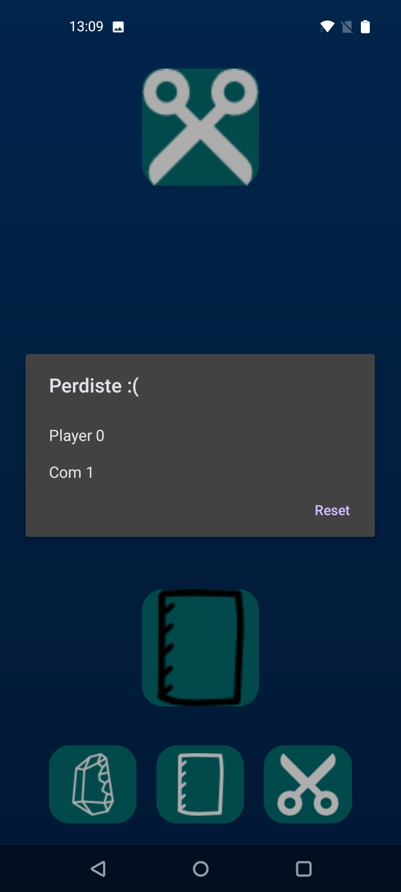
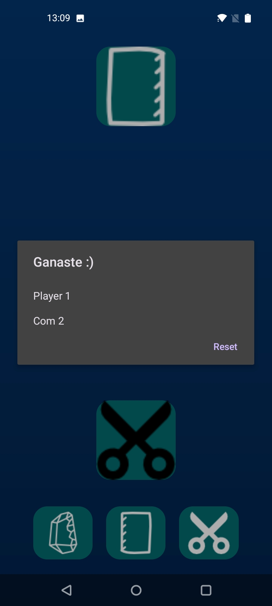

# MiniJuegos

App Android donde se coleccionan distintos tipos de juegos sencillos para practicar el lenguaje de programacion Kotlin

El listado de juegos se ira actualizando 

1 Piedra papel y tijeras 

2 Gato "Tic-Tac-Toe, Tres en raya" 

3 en desarrollo ... 

iconos usados <a href="https://www.flaticon.com/free-icons/rock-paper-scissors" title="rock paper scissors icons">Rock paper scissors icons created by Freepik - Flaticon</a>

